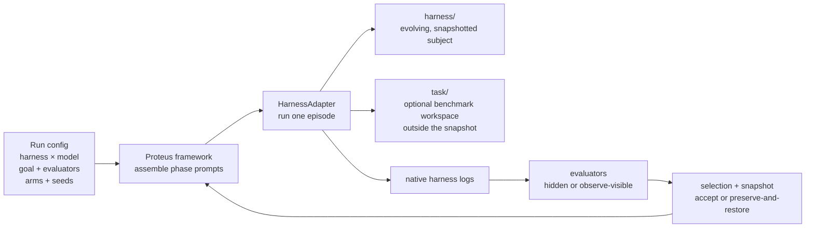

<p align="center">
  
</p>

<h3 align="center">Self-evolution for any agent harness.</h3>

<p align="center">
  <b>Plug in. Evolve. Measure.</b>
</p>

<p align="center">
  <a href="https://github.com/proteus-evolve/Proteus/actions/workflows/ci.yml"></a>
  <a href="https://github.com/proteus-evolve/Proteus/actions/workflows/release-smoke.yml"></a>
  <a href="LICENSE"></a>
  
  
  
</p>

<p align="center">
  <a href="#-60-second-demo-no-api-key-no-docker">Quick Start</a> •
  <a href="#-harnesses-in-the-box">Harnesses</a> •
  <a href="#%EF%B8%8F-how-it-works">How It Works</a> •
  <a href="docs/EPISODE.md">The Episode Loop</a> •
  <a href="docs/ADAPTERS.md">Onboard Your Harness</a> •
  <a href="docs/RECIPES.md">Recipes</a> •
  <a href="docs/BENCHMARKS.md">Bring a Benchmark</a> •
  <a href="docs/MEASUREMENTS.md">Add a Measurement</a> •
  <a href="docs/releases/v0.3.0.md">v0.3.0 Notes</a> •
  <a href="environments/README.md">Environments</a> •
  <a href="#-measurement">Measurement</a>
</p>

---

Plug in *any* agent harness × *any* model, let it rewrite its own harness over many
context-fresh episodes, and measure **how the harness changes** — under a goal, many goals,
or no goal at all.

> Named for the sea-god who changes shape at will: Proteus watches a harness reshape
> itself, and gives you the ruler to measure the change.

## 🔭 Why Proteus is different

Agent self-improvement is moving from the weights to the **harness** — the prompts, memory,
skills, tools, and control loop the model runs on. Recent systems evolve a harness to raise
a benchmark score. Proteus asks a different, complementary question: **what does a
self-evolving harness actually *do*, and does an initial condition leave a permanent mark?**

Three things set it apart from every existing harness-evolution system:

1. **Harness-agnostic.** Others evolve harnesses built from their *own* primitives. Proteus
   evolves *yours*: implement one small `HarnessAdapter` and your agent — the bundled
   offline `minimal` harness (the CLI default), DeepSeek Harness, Pi, Aki, or your own —
   plugs into the same framework, sandbox, and measurement.
2. **Goal *and* no-goal, with visible or hidden evaluators.** Others hard-code a single
   regime: one benchmark verifier, agent blind to the score, goal mandatory. Proteus spans
   the space — `no-goal | one goal | many goals`, and evaluators the agent either **sees**
   (in the observe phase) or **never sees**. No-goal, unpressured evolution is a
   first-class mode.
3. **A measurement instrument, not just a score.** Others report task pass-rates. Proteus
   ships the ruler for the harness itself: **structural distance** between harness states
   (per surface, path length), a **crystallization / swap** test (remove the disposition,
   read the harness back), and **behavioural distance** with a permutation test (the
   action-preference statistic). Every condition is read with the same ruler.

## 🚀 60-second demo (no API key, no Docker)

```bash
pip install proteus-evolve  # no model SDK; Python 3.10 adds only a TOML compatibility package
```

The bundled `minimal` harness runs fully offline, so you can see the whole pipeline before
wiring up a real agent:

```bash
proteus run --harness minimal \
    --arm neutral --arm review:notes --arm review:tools \
    --seeds 4 --episodes 8 --out runs/demo
proteus measure --harness minimal --out runs/demo
```

```
arm              seeds       notes       tools   (mean units built)
neutral              4         3.5         4.0
review_notes         4        13.0         0.0
review_tools         4         3.8         8.0

behavioural R (between/within arms, last episode): 3.075  p=0.0150
```

An installed action preference measurably shifts what the harness grows — and the same
`measure` reads a no-goal run and a goal run identically.

## 🧩 Harnesses in the box

| adapter | what it is | needs |
|---|---|---|
| `minimal` | offline reference harness (mock policy) | nothing |
| `llm` | the same harness driven by a live model — any OpenAI-compatible endpoint, DeepSeek by default | an API key |
| `dsh` | [DeepSeek Harness](https://github.com/deepseek-ai/deepseek-harness), headless profile, in a prepared container | Docker + a DeepSeek key |
| `pi` | [Pi](https://github.com/badlogic/pi-mono) — Mario Zechner's minimal coding harness (4 tools, native AGENTS.md + skills) | Docker + a DeepSeek key |
| `aki` | the Aki research harness (the paper's apparatus), contained in a source-built network-disabled image | Docker + the local image + a host controller key for live runs |
| yours | `--harness <module>:<Class>` — no registration | your adapter |

`dsh` and `pi` are the source-evolving third-party integrations. At seed time each adapter
extracts the pinned harness's real TypeScript source into `harness/src/`. During episode N,
all four phases boot the same read-only last-valid snapshot while writing a separate
candidate. After reflect, Proteus rebuilds and validates the candidate; only a passing
candidate activates in episode N+1. A failed build is prevented from activating, while
its exact tree is restored as the next writable repair candidate; the next episode's
running harness remains healthy. The source is therefore a
measured, snapshotted `loop` surface alongside instructions, notes, tools, and skills. The
adapters still leave the upstream repositories untouched: they arrange the run copy,
launch one prepared container per phase, and parse the harness's own session logs.

Aki uses a stricter contained runtime. Build its private checkout into the pinned local
image once, then verify the exact image before running:

```bash
AKI_HARNESS_SRC=/absolute/path/to/Aki environments/aki-src/build.sh
environments/aki-src/verify-image.sh
```

`AKI_HARNESS_SRC` is build input only; Aki runs do not import or execute that host checkout.
The CLI requires `proteus-env-aki-src:0.1.0` (or the exact image selected by `--env`) to
already exist locally before it opens a model channel or seeds a run. Initialization,
ordinary evolution, and safety episodes all execute in Docker with `--network none` and
exchange length-prefixed JSON over stdin/stdout. The container receives no provider key.
Proteus opens the ordinary `--model` channel and, only when a suite is selected, separate
`--safety-model` channels on the host; their raw provider ledgers and safety evidence stay
controller-private.

The run mount contract is active state read-only at `/workspace/active`, candidate state
read-write at `/workspace/candidate`, an optional task at `/workspace/task` read-write, and
ephemeral handoff state at `/state`. No Proteus checkout, `.env`, Docker socket, or private
controller artifact is mounted. Post-run existing-output analysis with `proteus measure`,
`proteus audit`, or `proteus reliability` is image-free: these commands parse finished
traces and snapshots without executing Aki code.
Passing the offline image verifier and deterministic Docker smokes establishes only the
mechanism and containment boundary; claims about a model such as `gpt-5.6-luna` require a
separately authorized live run with that exact model and fresh artifacts.

## 🏗️ How it works



Every seed runs `N` context-fresh **episodes**. Evolved harness files cross the episode
boundary; adapters that opt into framework continuity also receive a bounded operational
handoff stored outside the measured snapshot. One episode is four phases:

```
observe  →  propose  →  act  →  reflect
```

- **observe** — take stock; if you configured a *visible* evaluator, its score on the last
  episode is shown here.
- **propose** — list ways to improve your own harness.
- **act** — carry one out by editing the harness. The goal, if any, is announced in every
  fresh phase so observation and planning stay aligned with it.
- **reflect** — decide what to keep.

The **framework** owns everything that is not the harness (prompts, goal text, evaluator
routing, snapshotting, selection, measurement). The **adapter** owns everything that is
(how the four phases actually execute). That split is what makes Proteus harness-agnostic.

### The core objects

| Concept | What it is |
|---|---|
| `HarnessAdapter` | the contract a harness implements: its surfaces, phase-continuity capability, how to run an episode, how to read the action trace, how to install/remove a disposition |
| `Surface` | one editable, persistent region (memory / skills / tools / code / …), declared as data so the measurement layer needs no hard-coded names |
| `Disposition` | the action-preference perturbation — a **single, removable** change at t=0 (prompt suffix, config value, or code patch) |
| `GoalConfig` | goal / no-goal / multi-goal, each evaluator `HIDDEN` or `OBSERVE`-visible, plus outer-loop selection (`accept_reject`) |
| `Sandbox` | where an episode runs; `LocalSandbox` (trusted) or `DockerSandbox` (OS-level isolation, tunable network) |

### Action preference

An action preference is installed as a `Disposition` and is guaranteed **removable**, so the
crystallization test can take it away and read what the harness built on its own:

```python
from proteus.core import review, record, NEUTRAL
review("memory")     # each phase: review your memory, act or not
record("tools")      # keep your tools current as you work
NEUTRAL              # the control, F0 — no perturbation
```

### Goals and evaluators

```python
from proteus.core import EvaluatorSpec, GoalConfig, Visibility

GoalConfig.no_goal()                                    # unpressured evolution
GoalConfig.of(text="Become more reliable.")             # stated goal, no evaluator
GoalConfig.of(
    text="Become more reliable.",
    evaluators=(EvaluatorSpec("reliability", my_eval,
                              visibility=Visibility.OBSERVE),),
)                                                       # agent sees the score next episode
GoalConfig.of(text="Pursue A and B together.",
              evaluators=(EvaluatorSpec("a", eval_a),
                          EvaluatorSpec("b", eval_b)),
              selection="accept_reject")               # outer loop rejects regressions
```

An evaluator is any callable `(trace, ctx) -> EvalResult`; bring a benchmark verifier, an
LLM judge, or one of the built-ins (`proteus.core.evaluators`).

### Sandbox

```python
from proteus.sandbox import SandboxConfig, DockerSandbox
DockerSandbox(SandboxConfig(network="none"))    # no egress
DockerSandbox(SandboxConfig(network="host",     # needs an LLM endpoint
                            env_passthrough=("OPENAI_API_KEY",),
                            mem_limit="4g"))
```

A self-editing agent writes and runs its own code, so an application-level file sandbox
cannot contain it — Proteus runs real harnesses in a container whose filesystem holds the
harness and nothing else.

## 🔌 Onboard your harness

The input is a **repository** — a git URL or local path:

```bash
proteus env scaffold --from https://github.com/org/their-harness --name theirs --ref v1.2.0
proteus env build theirs             # pinned image, resolved sha recorded in the manifest
# write the adapter (7 methods), then:
proteus check --harness mypkg.theirs_adapter:TheirsHarness --episode
proteus run   --harness mypkg.theirs_adapter:TheirsHarness --arm neutral ...
```

`proteus check` machine-verifies the contract (removable disposition via fingerprint
round-trip, snapshot-ability, trace shape). The full guide: [docs/ADAPTERS.md](docs/ADAPTERS.md).
To start from a working skeleton instead of a blank file,
`python -m proteus.scaffold adapter MyHarness` copies the fully-commented
[proteus/examples/adapter_template.py](proteus/examples/adapter_template.py) — see
[CONTRIBUTING.md](CONTRIBUTING.md). The templates ship on PyPI too; outside a Git checkout
the default output is the current directory (or choose an explicit `--dest`).

## 📦 Prepared environments

`environments/` contains two environment shapes. Manifest-backed environments pair a
`Dockerfile` or prebuilt image with `environment.toml`; the built-in `dsh-src/`, `pi-src/`,
and `aki-src/` images are instead built from pinned upstream source checkouts, because the image
must contain the exact source and toolchain that the adapter later extracts and rebuilds.
In both shapes evolving state lives in mounts, never in a per-run image. Conventions:
[environments/README.md](environments/README.md); design notes:
[docs/ENVIRONMENTS.md](docs/ENVIRONMENTS.md).

## 📏 Measurement

```python
from proteus.measure import distance, stream, crystallize
```

- `distance` — structural distance per surface (added / dropped / revised), path length
  (`proteus measure --travel`).
- `stream` — behavioural distance (frequency / order / procedure) and the between/within
  permutation test `R`.
- `crystallize` — mount an evolved state under a neutral disposition and test whether it
  reads back as its own endpoint (two-stage fidelity + arm-shift).

To add a per-episode measurement evaluator, a post-run statistic, or an adapter-native
counter, see [docs/MEASUREMENTS.md](docs/MEASUREMENTS.md). The guide covers their different
contracts, artifact boundaries, CLI/report integration, statistical rules, and tests.

## 📤 Outputs

Every run's primary artifact is its **evolution history as a git repository** — one commit
per episode. Keep it local, browse it, or push it wherever you like (never automatic):

```bash
proteus repo export runs/demo/runs/run-<id> my-evolution   # normal repo, `git log` = the trajectory
proteus repo push   runs/demo/runs/run-<id> git@github.com:you/my-evolution.git
```

Every sweep also ships a **live tracking page** — per-run progress, per-surface growth
curves, evaluator scores — updating while the sweep runs:

```bash
proteus watch --out runs/demo          # http://localhost:8300/report.html
```

Tracking data (condition labels, hidden scores) lives at the sweep level, outside run
roots, so the evolving agent can never read its own condition.

## 📊 Status

`v0.3.0` (research preview). Working today: the offline `minimal` harness; the live `llm`
harness; pinned, source-evolving DeepSeek Harness and Pi adapters with frozen per-episode
activation, automatic rollback, exact-tree boundary gates, rebuild caching, turn budgets,
phase-aware act-priority budget plans and agent-authored checkpoint tracking, and task
mounts; the Aki research adapter; local, Polyglot, and SWE-bench task integrations;
resume-safe sweeps; the full measurement,
audit, reliability, report, and repository-export paths; and adapter/environment tooling.
CI covers Python 3.10–3.14. The separate release-smoke workflow runs two episodes across
the public release set (`minimal`, `llm`, `dsh`, `pi`), exercises the benchmark path, and
requires both container harnesses to edit their own source and boot the edit; releases use
pinned upstream versions, while the weekly upstream canary is advisory. As a
cross-implementation check, Proteus's
behavioural ruler applied to the research runs independently reproduces their headline
dynamics: arms separate at episode 1 (R = 1.63) and converge by episode 30 (R = 0.93).

## 🤝 Contributing

The two highest-value contributions are **a new harness adapter** (evolve another agent
framework) and **a new benchmark** (measure under more goals). Both are single-file,
contract-checked, CI-gated additions:

```bash
python -m proteus.scaffold adapter MyHarness    # skeleton -> proteus/adapters/myharness.py
python -m proteus.scaffold benchmark my_task    # skeleton -> proteus/bench/my_task.py
proteus check --harness proteus.adapters.myharness:MyHarness --episode
```

The step-by-step guide (contract, templates, the conformance gate in
`tests/test_conformance.py`, PR expectations) is [CONTRIBUTING.md](CONTRIBUTING.md).

Where help is wanted, in one line each — the full list with difficulty tags is
[ROADMAP.md](ROADMAP.md):

- **More harnesses** — Hermes Agent first (Python, built-in self-improvement surfaces),
  then SWE-agent, OpenClaw, Codex CLI, OpenHands, OpenCode, Goose.
- **More benchmarks** — BigCodeBench-lite and a LiveCodeBench subset, SWE-bench
  Lite/Verified wiring, and finishing sandboxed grading for `swe` (HumanEval and MBPP
  are shipped).
- **Analysis** — `proteus compare` for side-by-side arms/runs; an episode-atlas view.
- **Reproducibility & cost** — per-episode token/cost accounting; one-command reproduce.

## 📖 Citation

See [CITATION.cff](CITATION.cff). A paper reference will be added when the preprint is
public.

## License

MIT.
