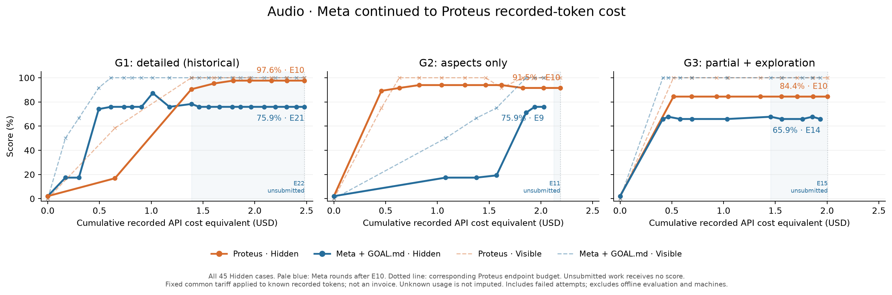
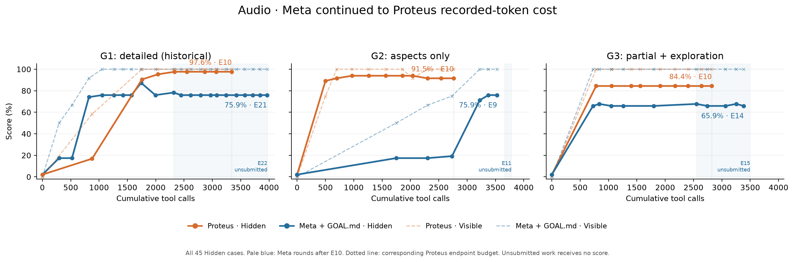

# Audio goal specificity: Meta continued to Proteus cost

Experiment closed on **2026-10-07 UTC**. This record compares the original
Proteus and Meta trajectories under three Audio goals, then continues each
original Meta trajectory beyond its initial ten attempts until it reaches the
corresponding Proteus recorded-token cost. No new Proteus trajectory was run for
this continuation.

Across these three trajectories, additional Meta budget did not close the gap
in the latest measured Hidden scores. This is a descriptive result from one
trajectory per method and tier, without replicates or confidence intervals. It
does not isolate the causal contribution of Proteus self-evaluators.

## Final results

Costs and tool calls include all authoring attempts, including failed and
unsubmitted work. Scores below refer to the **latest available scored candidate**;
they are not selected using Hidden results.

| Goal | Proteus cost (USD) | Meta cost (USD) | Proteus tool calls | Meta tool calls | Proteus latest Hidden | Meta latest Hidden |
|---|---:|---:|---:|---:|---:|---:|
| G1: detailed, historical | 2.477817360 | 2.479069926 | 3,340 | 3,969 | 97.6190% (E10) | 75.9259% (E21) |
| G2: aspects only | 2.185772676 | 2.185815948 | 2,763 | 3,781 | 91.5344% (E10) | 75.9259% (E9) |
| G3: partial brief + exploration | 2.003243292 | 2.004826014 | 2,821 | 3,499 | 84.3915% (E10) | 65.8730% (E14) |

Meta's native rule selects the best complete Visible score among viable
candidates, with the earliest candidate winning ties:

| Goal | Native-selected Meta candidate | Visible | Hidden measured after selection |
|---|---:|---:|---:|
| G1 | E4 | 100% | 75.9259% |
| G2 | E7 | 100% | 71.1640% |
| G3 | E1 | 100% | 65.8730% |

The Proteus values in the first table are the measured E10 endpoints. This record
does not label those endpoints as Proteus's native-selected winners.

## Final curves





Solid lines show Hidden scores; dashed lines show Visible scores. Pale blue
marks Meta attempts after E10. Dotted lines mark the corresponding Proteus
endpoint budget on each axis. Lines connect available measured points across
unavailable candidates as a visual guide; absent scores remain null in the data.

Vector exports: [cost PDF](figures/matched_cost_all_45.pdf),
[tool-call PDF](figures/matched_cost_all_45_tool_calls.pdf).

## Goal treatment and measurement

- [G1 actual delivered goal](goals/G1-GOAL.md): the original detailed Audio goal,
  reused as the historical reference. A later drafted G1 goal was not run here.
- [G2 actual delivered goal](goals/G2-GOAL.md): the measured aspects with fewer
  implementation details.
- [G3 actual delivered goal](goals/G3-GOAL.md): a partial product brief plus an
  explicit request to explore further audio improvements.

The paired methods received their tier's goal. The Meta condition has goal text
and Visible feedback without the explicit M1 preference. Hidden results did not
enter authoring, native parent selection or public history. G1's full goal was
delivered through the original controller/manifest; it was not stored as
`visible/GOAL.md`. G2 and G3's tier goals were verified in their public goal files.
The legacy manifest flag `full_product_goal_exposed` identifies the original
detailed goal; its false value for G2/G3 does not mean their tier goal was hidden.

The subject is the pinned DeepSeek Harness, with Web, ACP and headless Audio
entry points. The recorded authoring model alias is `deepseek-flash`, with an
expected model version of `DeepSeek-V4.1-Flash`; the alias is not an immutable
model pin. Source, image, goal and criterion hashes are in
[provenance.json](data/provenance.json).

There are **12 Visible and all 45 Hidden cases**. The Hidden domain counts are
7, 7, 7, 9, 7 and 8 for D1–D6. The score is the equal-weight mean of the six
domain scores, with equal case weights within a domain. It is therefore not the
pooled pass count divided by 45. For example, E21 has 34 passes and 11 failures,
but its domain-weighted score is exactly **41/54 = 75.9259%**.

This record uses the full Hidden set, including its overlap with Visible;
it does not apply the earlier overlap-removal analysis. Native functional checks
use scripted ASR/model transports. These scores do not measure independent real
speech-recognition quality. Every eligible continuation candidate was measured
with a fresh six-lane report: API, safety, browser, headless, configuration and
ACP. The 15 new eligible reports each contain all 45 cases and zero unresolved
cases. The criterion kernel stayed frozen; qualified calling-convention adapters
and their hashes are recorded in the audit provenance. No live model calls were
made by these offline Hidden measurements.

## Cost and cutoff protocol

This is a common-price equivalent of **known recorded tokens**, not an invoice.
The frozen tariff is USD per million tokens:

| Cache hit input | Cache miss input | Output |
|---:|---:|---:|
| 0.003 | 0.15 | 0.60 |

Equivalently, integer nanodollars are `3 × cache_hit + 150 × cache_miss + 600 × output`.
Missing historical generation usage remains unknown and is not imputed.
Count-tokens requests without generation usage remain accounted for separately.
No continuation generation response has unknown usage.

The cumulative axes include original evolution, failures, child-agent work and
all paid Proteus phases. They exclude machine/cloud expenses, offline evaluator
execution/setup, and operator/recovery work. Tool-call counts come from recorded
provider tool calls; they are distinct from model-request counts.

Paid requests were serialized. Each cost target was crossed by exactly one
indivisible final response, after which no further paid response was accepted:

| Goal | Last cutoff attempt | Submission | Overshoot (USD) |
|---|---:|---|---:|
| G1 | E22 | Unsubmitted | 0.001252566 |
| G2 | E11 | Unsubmitted | 0.000043272 |
| G3 | E15 | Unsubmitted | 0.001582722 |

These attempts have no Visible or Hidden score. G2 E10 also has no available
official candidate score; its expenditure is retained. G2's latest scored
candidate is E9. Meta's initial ten-attempt costs were $1.389507540 (G1),
$2.123809428 (G2) and $1.454954484 (G3).

## Recovery and evidence limits

G1 E16's original public preparation timed out. The original failure report was
retained, and the same immutable candidate was remeasured with the same preparation
timeout, criteria, assets, images and product limits. Only its `score` and
`visible_status` were corrected. All paid history was retained, and the original
trajectory resumed at E17. The final provenance audit confirms zero replayed
model calls and unchanged native selection, goal and phase caps.

The G1 cost verifier's inappropriate `visible/GOAL.md` assumption was corrected
to verify the identical goal in its original hash-bound controller source and
manifest. G2's expired Docker exec handle was replaced by a fresh read-only run
of the identical cost verifier; its output matches the original audit except
for verification time. These repairs did not change a model trajectory or
candidate evaluation.

**G1 Proteus is a recovered historical reference:** original summary, manifest
and lock JSON were recovered and verified, but complete original report packs
are unavailable. Its result is not a fresh Proteus rerun. The publication contains
portable projections and original audit hashes; it does not contain the private
authoring logs, hidden fixtures, complete native report packs or the full experiment
runtime needed to rerun evolution. Publication checks validate the packaged data
and reproduce plots; they do not re-execute candidate tests.

## Files and offline reproduction

- [experiment.json](data/experiment.json): 84 baseline/candidate/attempt points,
  endpoint costs and scores, goal treatments and native Meta selection.
- [episode-points.csv](data/episode-points.csv), [summary.csv](data/summary.csv):
  tabular exports; empty score fields represent unavailable observations.
- [hidden-audit-metadata.json](data/hidden-audit-metadata.json): original hashes,
  exact domain scores, case IDs and pack metadata for the 15 new Hidden reports.
- [cost-audit-metadata.json](data/cost-audit-metadata.json): reconciled totals,
  request/tool counts and the single crossing response for each tier.
- [provenance.json](data/provenance.json): original artifact hashes, run pins,
  delivered-goal hashes, repair provenance and evidence limits.
- [MANIFEST.json](MANIFEST.json): SHA-256 hashes of the publication files.

From this directory, verify the publication with the standard library:

```bash
python3 verify_record.py
```

To reproduce both figures from the published data, use Python 3.11 or newer.
The original exports used Python 3.12.14 and Matplotlib 3.11.2:

```bash
python3 -m venv /tmp/lens-audio-plot-env
/tmp/lens-audio-plot-env/bin/pip install -r requirements-plot.txt
/tmp/lens-audio-plot-env/bin/python plot.py --output /tmp/lens-audio-plots
```
